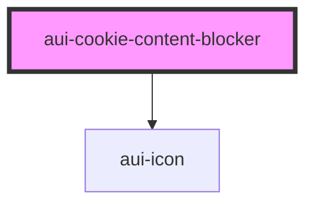

# cookie-content-blocker

```html
<aui-cookie-content-blocker title="Video kon niet getoond worden" icon="Je moet je cookievoorkeuren aanpassen om deze video te kunnen afspelen" icon="fa-youtube"></aui-cookie-content-blocker>
```

<!-- Auto Generated Below -->


## Properties

| Property      | Attribute     | Description                                        | Type     | Default     |
| ------------- | ------------- | -------------------------------------------------- | -------- | ----------- |
| `branding`    | `branding`    | This will add a classname to the component wrapper | `string` | `'aui'`     |
| `description` | `description` | The description                                    | `string` | `undefined` |
| `icon`        | `icon`        | Name of the FontAwesome icon you want to show      | `string` | `undefined` |
| `title`       | `title`       | The title                                          | `string` | `undefined` |


## Dependencies

### Depends on

- [aui-icon](../icon)

### Graph


----------------------------------------------

*Built with [StencilJS](https://stenciljs.com/)*
