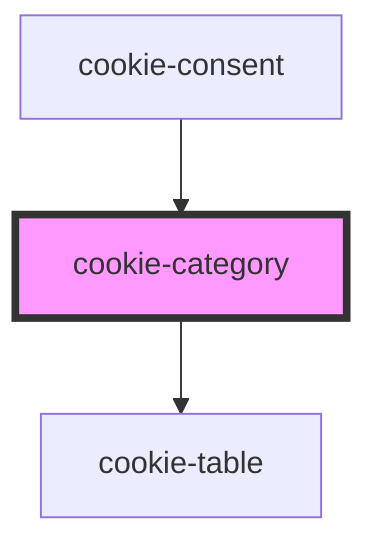

# cookie-category

<!-- Auto Generated Below -->

## Properties

| Property              | Attribute | Description | Type       | Default     |
| --------------------- | --------- | ----------- | ---------- | ----------- |
| `data`                | --        |             | `any[]`    | `undefined` |
| `index`               | `index`   |             | `number`   | `undefined` |
| `onCheckCategory`     | --        |             | `Function` | `undefined` |
| `onOpenCloseCategory` | --        |             | `Function` | `undefined` |

## Dependencies

### Used by

 - [cookie-consent](..)

### Depends on

- [cookie-table](../cookie-table)

### Graph

----------------------------------------------

*Built with [StencilJS](https://stenciljs.com/)*
