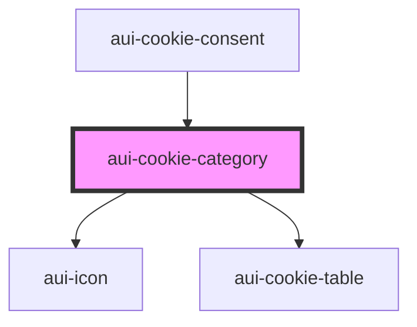

# aui-cookie-category

<!-- Auto Generated Below -->

## Properties

| Property | Attribute | Description | Type     | Default     |
| -------- | --------- | ----------- | -------- | ----------- |
| `data`   | --        |             | `any[]`  | `undefined` |
| `index`  | `index`   |             | `number` | `undefined` |

## Events

| Event               | Description | Type                  |
| ------------------- | ----------- | --------------------- |
| `checkCategory`     |             | `CustomEvent<number>` |
| `openCloseCategory` |             | `CustomEvent<number>` |

## Dependencies

### Used by

 - [aui-cookie-consent](..)

### Depends on

- [aui-icon](../../icon)
- [aui-cookie-table](../cookie-table)

### Graph

----------------------------------------------

*Built with [StencilJS](https://stenciljs.com/)*
