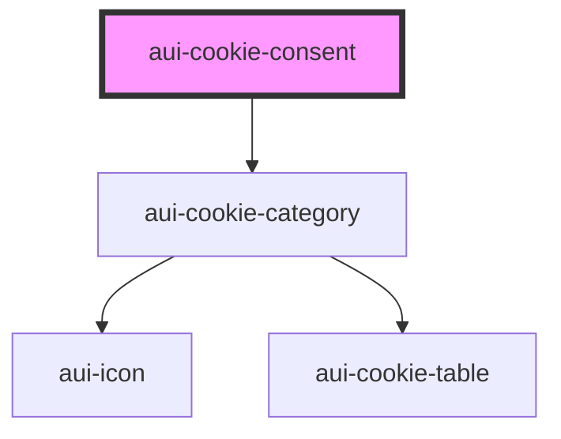

# cookie-consent
```html
<aui-cookie-consent config={configObject}></aui-cookie-consent>
```

Example of config JSON object:
```json
{
	"title": "Welkom!",
	"intro": "Antwerpen.be maakt gebruik van cookies. Aan de hand van die cookies verzamelt en analyseert Antwerpen.be informatie over uw bezoek. Genieten van een optimale A-ervaring? Bevestig met alle cookies toestaan. Stel voorkeuren in en bepaal welke informatie u met Antwerpen deelt. Houd er rekening mee dat bepaalde media enkel beschikbaar zijn indien u de cookies ervan aanvaardt. Antwerpen.be bewaart cookievoorkeuren. U kan ze aanpassen via cookies beheren. Meer weten? Raadpleeg onze Cookieverklaring. Antwerpen.be waardeert uw vertrouwen en wenst u een verrijkende surfervaring toe!",
	"cookieConfig": [
		{
			"name": "Noodzakelijk",
			"showSwitch": false,
			"enabled": true,
			"description": "Analytische cookies verzamelen algemene informatie over de manier waarop onze website wordt gebruikt. Op basis van deze informatie kunnen wij een statische analyse maken van het gebruik van de website. Op basis van deze analyse kunnen wij de structuur, navigatie en inhoud van onze website gebruiksvriendelijker maken en verbeteren.",
			"open": false
		},
		{
			"name": "Functioneel",
			"showSwitch": true,
			"enabled": true,
			"description": "Analytische cookies verzamelen algemene informatie over de manier waarop onze website wordt gebruikt. Op basis van deze informatie kunnen wij een statische analyse maken van het gebruik van de website. Op basis van deze analyse kunnen wij de structuur, navigatie en inhoud van onze website gebruiksvriendelijker maken en verbeteren.",
			"open": false
		},
		{
			"name": "Analytics",
			"showSwitch": true,
			"enabled": false,
			"description": "Analytische cookies verzamelen algemene informatie over de manier waarop onze website wordt gebruikt. Op basis van deze informatie kunnen wij een statische analyse maken van het gebruik van de website. Op basis van deze analyse kunnen wij de structuur, navigatie en inhoud van onze website gebruiksvriendelijker maken en verbeteren.",
			"open": false,
			"cookies": [
				{
					"cookie": "Google analytics",
					"type": "Eerste partij",
					"duration": "1 minuut tot 2 jaar",
					"description": "Via deze cookies krijgt antwerpen.be onder meer informatie over het aantal (unieke) bezoekers, de bezoekerssessies, hoe de bezoekers de site gebruiken en via welk kanaal (sociale media, zoekrobots, etc.) antwerpen.be werd bereikt. Google Analytics geeft vervolgens inzicht in deze data aan de hand van een analyserapport. Lees hier het privacybeleid van Google.",
					"subCookies": [
						{
							"name": "__utma",
							"duration": "2 jaar"
						},
						{
							"name": "__utmb",
							"duration": "30 min"
						},
						{
							"name": "__utmt",
							"duration": "10 min"
						},
						{
							"name": "__utmz",
							"duration": "6 maanden"
						},
						{
							"name": "_ga",
							"duration": "2 jaar"
						},
						{
							"name": "_gat",
							"duration": "1 min"
						},
						{
							"name": "_gid",
							"duration": "1 dag"
						}
					]
				},
				{
					"cookie": "Youtube VISITOR_INFO1_LIVE",
					"type": "Derde partij",
					"duration": "5 maanden",
					"description": "YouTube, een website voor het plaatsen en het delen van video’s, gebruikt cookies om data te verzamelen van individuele bezoekers en om na te gaan welke functies of voorkeuren door bepaalde gebruikers werden geselecteerd. Lees hier het privacybeleid van YouTube."
				}
			]
		},
		{
			"name": "Marketing",
			"showSwitch": true,
			"enabled": false,
			"description": "Analytische cookies verzamelen algemene informatie over de manier waarop onze website wordt gebruikt. Op basis van deze informatie kunnen wij een statische analyse maken van het gebruik van de website. Op basis van deze analyse kunnen wij de structuur, navigatie en inhoud van onze website gebruiksvriendelijker maken en verbeteren.",
			"open": false
		}
	]
}
```

## Example in React

Read the docs [here](./docs/cookie-consent-react.md)

<!-- Auto Generated Below -->


## Properties

| Property           | Attribute          | Description                                                                                                                 | Type       | Default     |
| ------------------ | ------------------ | --------------------------------------------------------------------------------------------------------------------------- | ---------- | ----------- |
| `branding`         | `branding`         | This will add a classname to the component wrapper                                                                          | `string`   | `'aui'`     |
| `config`           | `config`           | Configuration of your cookie consent window                                                                                 | `string`   | `undefined` |
| `domain`           | `domain`           | Set the domain where you want your cookiepreferences to be saved. eg. 'antwerpen.be'                                        | `string`   | `undefined` |
| `environment`      | `environment`      | Set the current enovironment, this will impact the name of the cookie where the preferences will be saved. eg. 'acceptance' | `string`   | `undefined` |
| `excludedpaths`    | `excludedpaths`    | Single path or comma seperated list of paths on which the cookie consent will not open                                      | `string`   | `undefined` |
| `openPreferences`  | `open-preferences` | If set to true, the modal will show the cookie preferences and not the default screen with the title and description        | `boolean`  | `undefined` |
| `preferencesSaved` | --                 | Runs when new cookie preferences are saved                                                                                  | `Function` | `undefined` |


## Dependencies

### Depends on

- [aui-cookie-category](cookie-category)

### Graph


----------------------------------------------

*Built with [StencilJS](https://stenciljs.com/)*
