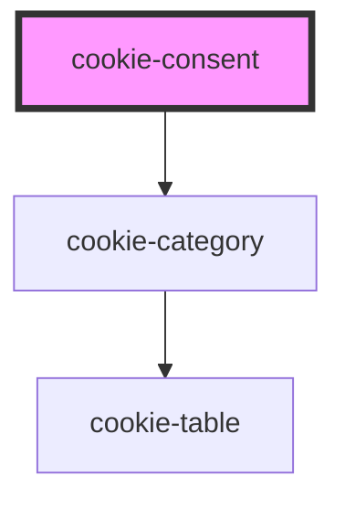

# cookie-consent

<!-- Auto Generated Below -->

## Properties

| Property          | Attribute          | Description                                                                                                                 | Type      | Default     |
| ----------------- | ------------------ | --------------------------------------------------------------------------------------------------------------------------- | --------- | ----------- |
| `branding`        | `branding`         | This will add a classname to the component wrapper                                                                          | `string`  | `"aui"`     |
| `config`          | `config`           | Configuration of your cookie consent window                                                                                 | `string`  | `undefined` |
| `domain`          | `domain`           | Set the domain where you want your cookiepreferences to be saved. eg. 'antwerpen.be'                                        | `string`  | `undefined` |
| `environment`     | `environment`      | Set the current enovironment, this will impact the name of the cookie where the preferences will be saved. eg. 'acceptance' | `string`  | `undefined` |
| `openPreferences` | `open-preferences` | If set to true, the modal will show the cookie preferences and not the default screen with the title and description        | `boolean` | `undefined` |

## Dependencies

### Depends on

- [cookie-category](cookie-category)

### Graph

----------------------------------------------

*Built with [StencilJS](https://stenciljs.com/)*
