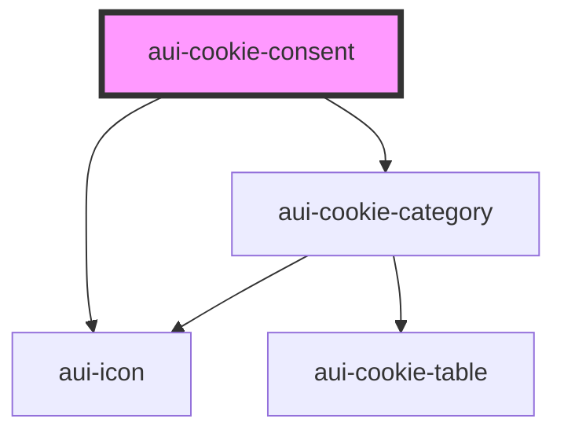

# aui-cookie-consent

<!-- Auto Generated Below -->

## Properties

| Property           | Attribute          | Description                                                                                                                 | Type                    | Default     |
| ------------------ | ------------------ | --------------------------------------------------------------------------------------------------------------------------- | ----------------------- | ----------- |
| `branding`         | `branding`         | Extra CSS class(es) to add                                                                                                  | `string`                | `'aui'`     |
| `config`           | `config`           | Configuration of your cookie consent window                                                                                 | `string`                | `undefined` |
| `domain`           | `domain`           | Set the domain where you want your cookiepreferences to be saved. eg. 'antwerpen.be'                                        | `string`                | `undefined` |
| `environment`      | `environment`      | Set the current enovironment, this will impact the name of the cookie where the preferences will be saved. eg. 'acceptance' | `string`                | `undefined` |
| `excludedpaths`    | `excludedpaths`    | Single path or comma seperated list of paths on which the cookie consent will not open                                      | `string`                | `undefined` |
| `openPreferences`  | `open-preferences` | If set to true, the modal will show the cookie preferences and not the default screen with the title and description        | `boolean`               | `undefined` |
| `preferencesSaved` | --                 | Runs when new cookie preferences are saved                                                                                  | `Function`              | `undefined` |
| `translations`     | --                 | Set the translation strings for the cookie consent                                                                          | `TranslationsInterface` | `undefined` |

## Dependencies

### Depends on

- [aui-cookie-category](cookie-category)
- [aui-icon](../icon)

### Graph

----------------------------------------------

*Built with [StencilJS](https://stenciljs.com/)*
