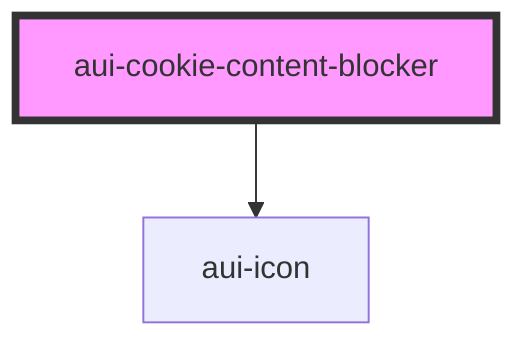

# aui-cookie-content-blocker

<!-- Auto Generated Below -->

## Properties

| Property      | Attribute     | Description                                           | Type     | Default     |
| ------------- | ------------- | ----------------------------------------------------- | -------- | ----------- |
| `branding`    | `branding`    | Extra CSS class(es) to add                            | `string` | `'aui'`     |
| `description` | `description` | A paragraph text to explain the content blocker title | `string` | `undefined` |
| `icon`        | `icon`        | The icon name (eg: ai-close)                          | `string` | `undefined` |
| `message`     | `message`     | The content blocker title                             | `string` | `undefined` |

## Dependencies

### Depends on

- [aui-icon](../icon)

### Graph

----------------------------------------------

*Built with [StencilJS](https://stenciljs.com/)*
