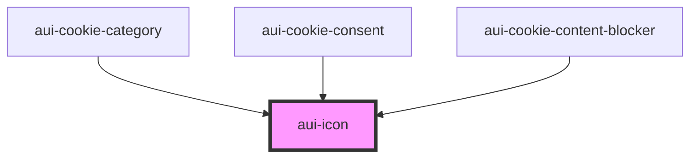

# aui-icon

<!-- Auto Generated Below -->

## Properties

| Property    | Attribute    | Description                  | Type     | Default     |
| ----------- | ------------ | ---------------------------- | -------- | ----------- |
| `ariaLabel` | `aria-label` | The ARIA label               | `string` | `undefined` |
| `branding`  | `branding`   | Additional CSS class(es)     | `string` | `undefined` |
| `name`      | `name`       | The icon name (eg: ai-close) | `string` | `undefined` |

## Dependencies

### Used by

 - [aui-cookie-category](../cookie-consent/cookie-category)
 - [aui-cookie-consent](../cookie-consent)
 - [aui-cookie-content-blocker](../cookie-content-blocker)

### Graph

----------------------------------------------

*Built with [StencilJS](https://stenciljs.com/)*
